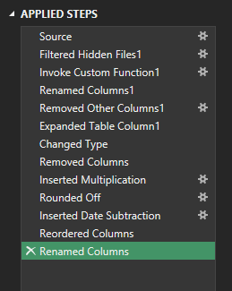
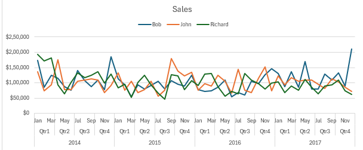
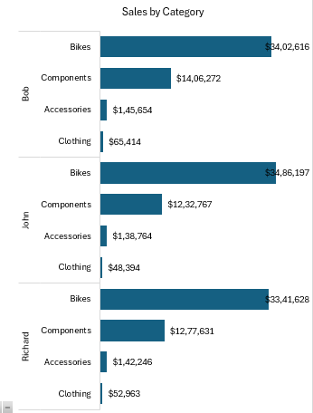
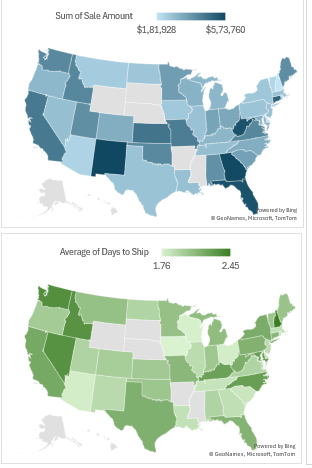
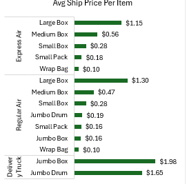
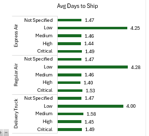
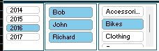

# 📊 Sales & Shipping Dashboard

_Interactive Excel dashboard analyzing sales and shipping performance_

---

## 📌 Project Overview

This project analyzes **sales performance and shipping operations** using Excel.  
It combines **Power Query for data transformation**, **Pivot Tables for analysis**, and **interactive dashboards** to deliver business insights.

The dashboard enables stakeholders to track revenue trends, evaluate shipping efficiency, and compare salesperson and product performance.

---

## 🎯 Business Objectives

- Analyze sales trends across years and quarters
- Compare performance of salespersons
- Identify top-performing product categories
- Evaluate shipping cost and delivery time
- Enable interactive, self-service analysis

---

## 📂 Project Files

- **Excel Dashboard:** `SalesProject.xlsx`
- **Documentation:** `README.md`

---

## 🧩 Dataset Overview

The dataset includes:

- Order year and quarter
- Salesperson
- Product category
- Shipping mode
- Product container
- US state-level sales
- Shipping cost and delivery duration

---

## 🔄 Data Preparation (Power Query)

Power Query was used to clean, transform, and prepare the raw data before analysis.

### Key Power Query Operations:

- Filtered unnecessary and hidden source files
- Renamed columns for clarity and consistency
- Removed irrelevant columns
- Expanded nested tables
- Changed data types
- Created calculated columns (e.g., shipping cost calculations)
- Rounded numeric values
- Performed date-based calculations
- Reordered columns for modeling

**Why Power Query?**

- Ensures clean and reliable data
- Automates data refresh
- Separates data preparation from analysis

---

## 🛠 Excel Skills & Features Used

- Power Query (ETL)
- Pivot Tables and Pivot Charts
- Slicers for interactive filtering
- Excel Maps for geographic analysis
- Calculated fields and measures
- Conditional formatting

---

## 🧮 Helper Pivot Tables (Backend Logic)

The dashboard is powered by multiple helper pivot sheets, each designed for a specific analytical purpose:

- **Sales Pivots** – sales by category, salesperson, and time
- **Ship Pivots** – shipping cost and delivery time analysis
- **Map Pivots** – state-level geographic aggregation
- **Sales Person Pivot** – individual performance breakdown

This modular design:

- Separates calculations from visuals
- Improves maintainability
- Makes the dashboard scalable

---

## 📊 Dashboard Components & Analysis

### 📈 Sales Trend Analysis

- Tracks monthly and quarterly sales trends
- Compares sales performance across salespersons
- Identifies seasonal patterns

---

### 📦 Sales by Category

- Shows revenue contribution by product category
- Highlights high- and low-performing products

---

### 🌎 Geographic Sales Analysis

- Displays sales distribution by US state
- Identifies high-revenue regions

---

### 🚚 Shipping Performance Analysis

#### Avg Shipping Price per Item

- Compares shipping cost across ship modes and container types
- Helps identify cost-efficient shipping methods

#### Avg Days to Ship

- Measures delivery performance
- Highlights delays by shipping method

---

## 🎛 Interactivity & Filters

The dashboard supports filtering by:

- Year
- Salesperson
- Product category
- Ship mode
- Product container

This enables dynamic exploration without changing formulas.

---

## 🧾 Conclusion

This project demonstrates the ability to:

- Prepare and clean data using Power Query
- Design scalable Excel data models
- Build interactive dashboards
- Translate data into actionable business insights
